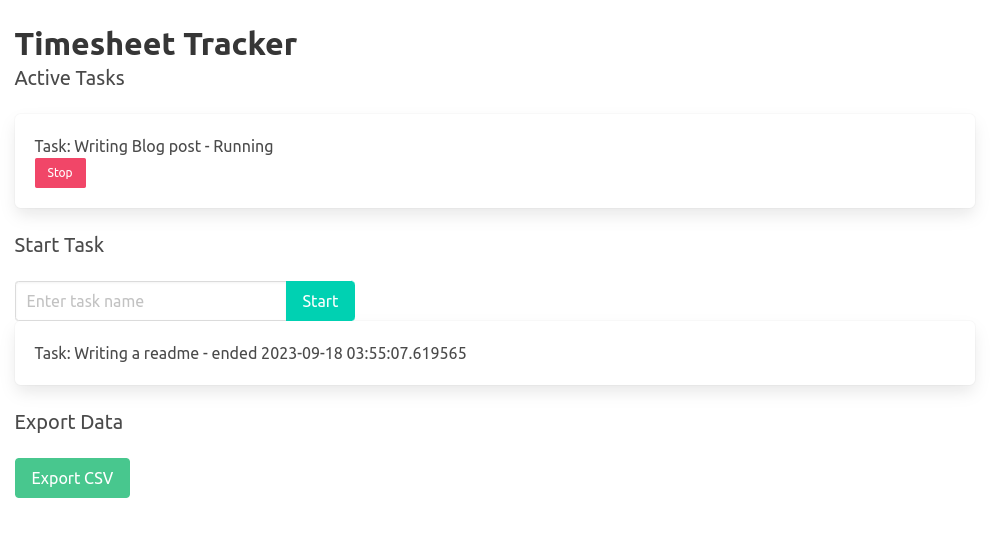

# Simple web based Time Tracker

No auth, no sessions, just a simple time tracker.

Exports to CSV as you wish.

Warning: there is no persistence as of yet, 
everything will be lost upon rebooting the program.

I got frustrated with tracking what I did for my timesheets.

## How to run

Requires Python3, install flask with

~~~bash
python3 -m pip install flask
~~~

run with:
~~~
git clone https://github.com/Perceval62/TimeTracker
python3 app.py
~~~

and then browse to

~~~
localhost:5000
~~~

## How to use

1. Write something in the text prompt
2. Click start
3. Repeat if you are a superhuman able to **really** multitask.
4. Stop the tasks you started when you are done.
5. Click Export to CSV when ready.

